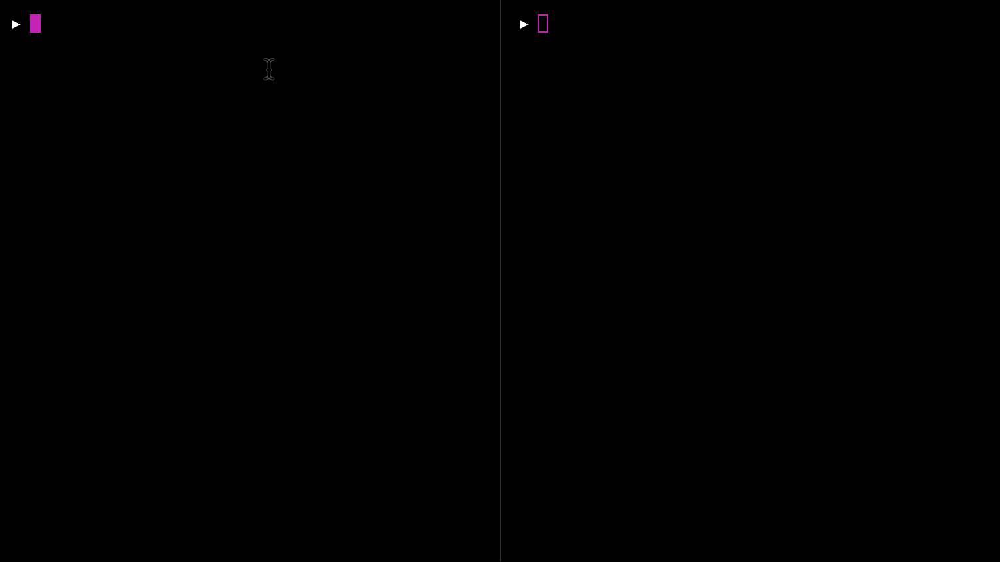

# Subscribers everywhere in Redux: example

This is a simple and useless command line app meant to demonstrate how listening to state diff in Redux is useful for more than just UI update.

To try the app, clone, run `yarn install` and start the server with:

```sh
yarn server -- 8080
```

`8080` is going to be the port where the server is listening to.



## What happens first

The first thing in the app, as you can see in [`server/index.js`](server/index.js), is that a Redux store gets setup, with a simple initial state that looks like this:

```javascript
const initialState = {
  port: undefined,
  serverStatus: 'OFF',
  messages: []
}
```

…and a reducer that will manage all of the app status, including setting up the server, and looks like this:

```javascript
const reducer = (state, {type, payload}) => {
  switch (type) {
    case 'SETUP':
      return {
        ...state,
        port: payload.port,
        serverStatus: 'STARTING'
      }

    case 'SERVER_UP':
      return {
        ...state,
        serverStatus: 'ON'
      }

    case 'CLIENT_MESSAGE':
      return {
        ...state,
        messages: [...state.messages, payload]
      }

    default:
      return state
  }
}
```

> You can go to the [`server/index.js`](server/index.js) file and uncomment some lines to get a really nice store debugging output

Once the store is set up, the app bootstraps itself by dispatching the `SETUP` action with the port specified as an argument in the command line—`8080` if you are following the example.

## What do to now

Now we can send messages to the server from another command line tool. To do that, open a new pane in your terminal and run:

```
yarn message -- 8080 Hello
```

> Only one word messages work

`8080` is naturally the port where the app is running, and `Hello` is our message. As you can see, the server logged that it got a new message.

The interesting thing is that is not the server that actually did that. The server, as you can check in the [`server/subscribers/server.js`](server/subscribers/server.js) file, is just dispatching an action of type `CLIENT_MESSAGE`. The reducer then updates the state with this new message, putting it in the `messages` array, and another subscriber, [`server/subscribers/logger.js`](server/subscribers/logger.js) will pick it up and, after noticing the new message in the list, will print out the message.

Let's send another message:

```
yarn message -- 8080 World
```

Now the server is printing out not only the current message but the ones before. If you enabled the verbose logging, you can see that this are kept in the store.

So far so good; it’s easy to imagine how this is similar to React updating the UI on state change so logging on state diff is not such a novelty. Why is it useful to have the server being started and listening on state change?

Well, one thing we can do now is to change it’s port from the outside.

```
yarn change-port -- 8080 1337
```

See the server logging the port change, exactly as it logged in the beginning when it was initialized from inside.

We can send messages to the new port now. The old messages are still around.

```
yarn message -- 1337 Foo
```

## But why? What do we win with this approach

**Reasoning is easier**
- Only one way of reasoning about side effects. DOM, network, logging, you name it. The same approach works everywhere.
- There is no need to retrigger or inspect chains of actions to debug a particular application behavior. Since everything is driven declaratively by state, injecting a state into a running application will immediately reproduce whatever scenario you want to test (this is of course true only of deterministic-enough side effects, but that is not unique to this approach)
- Application (business) logic can be tested entirely by unit testing the reducer. There is no logic scattered in sagas or thunks. Since the reducer is a pure function, application logic will also be enforced to be (easy to add Flowtypes, for example)

**Side effects are treated as logicless "drivers"**
- Side effects can be tested in isolation by injecting two states into them
- Side effects can be easily swapped
- Business logic accidentally embedded into side effects can be easily identified as a smell

## Things that would make this approach user-friendly

- Subscribers on state paths for the Redux store, instead of on full state update. There are many ways to mitigate this with [Ramda lenses](http://ramdajs.com/docs/#lensPath) or something similar.
- A way to abstract out the boilerplate around setting up a subscriber.
- React-like lifecycle listeners on subscribers on path(`propertyWasRemoved`, `propertyWasAdded`, `propertyWasChanged` and so on)
- …there is a lot more to it, since if we want to chain updates to the side effect tree we need something like a "generic React Fiber"

> PS: I’ve been working on something like this for a while and have an incomplete implementation in the [`tessellation`](https://github.com/xaviervia/tessellation/tree/zazenify/packages/tessellation) package. It only solves the part about setting up the side effect, but it doesn’t use. I just mention it in case you are curious, it’s research for the moment.

## License

[The Unlicense](LICENSE)
